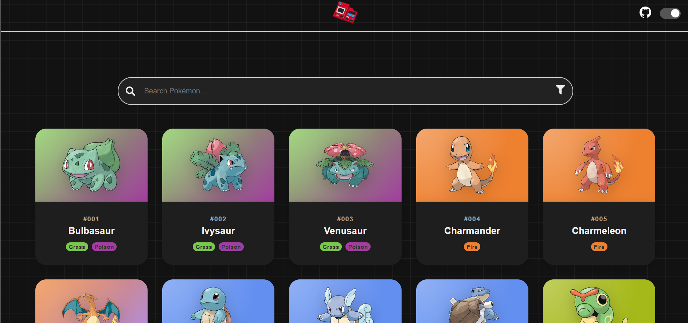
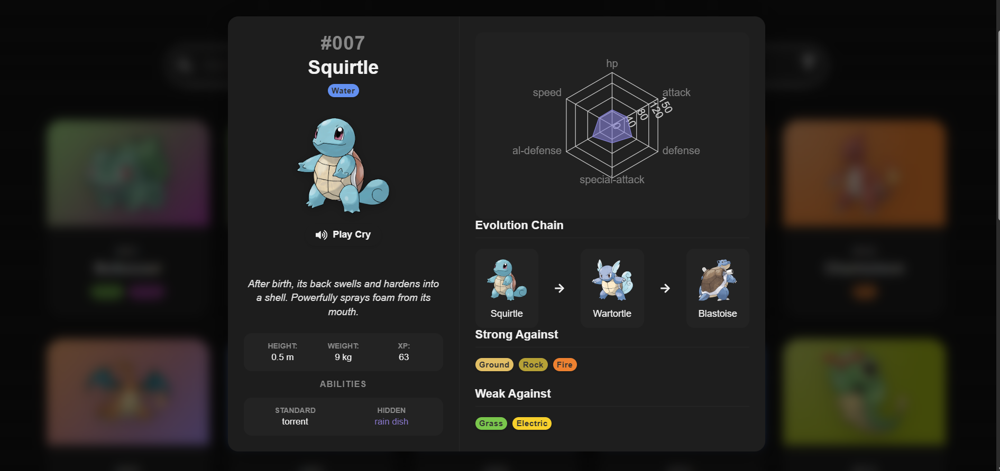
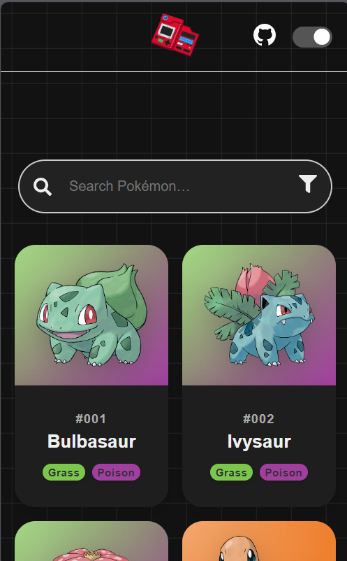

# React Pokedex

A modern, interactive Pokedex application built with **React** and **Vite**. This project features a stunning glassmorphism UI, real-time search, and detailed Pokemon statistics using the **PokeAPI**.

## Features

- **Modern Aesthetic**: beautifully designed with Glassmorphism, smooth animations, and a responsive grid layout.
- **Real-Time Search**: Instant filtering by name or ID without page reloads.
- **Advanced Filtering**: Filter Pokemon by **Type** (Multi-select) and toggle **Mega Evolutions**.
- **Dark & Light Mode**: Seamless theme switching with persistent user preference.
- **Interactive Stats**: 
  - Radar Chart for base stats.
  - Interactive **"Play Cry"** button to hear Pokemon sounds.
  - Evolution Chains with visual arrows.
  - Abilities card with "Hidden" ability tags.
- **Fully Responsive**: Optimized for desktop, tablet, and mobile devices.

## Tech Stack

- **React** (Hooks, Context API)
- **Vite** (Fast tooling)
- **PokeAPI** (Data source)
- **Recharts** (Radar charts)
- **CSS3** (Variables, Flexbox, Grid)

## Getting Started

### Prerequisites
- Node.js installed

### Installation

1. Clone the repository:
   ```bash
   git clone https://github.com/CraigDaGama/React-Pokedex.git
   ```
2. Navigate to the project folder:
   ```bash
   cd React-Pokedex
   ```
3. Install dependencies:
   ```bash
   npm install
   ```
4. Start the development server:
   ```bash
   npm run dev
   ```

## Screenshots


<div align="center">
  
  <p><strong>Home Screen</strong></p>

  
  <p><strong>Pokemon Details</strong></p>

  
  <p><strong>Mobile View</strong></p>
</div>


## License

This project is open source and available under the [MIT License](LICENSE).
